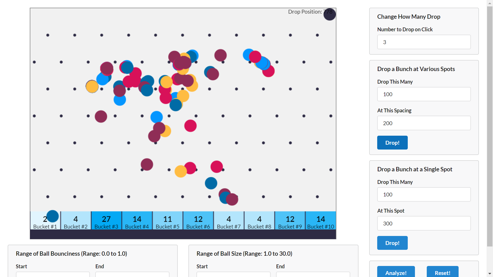

# :zap: Machine Learning With Javascript

* Javascript code following a Udemy Machine Learning course.
* **Note:** to open web links in a new window use: _ctrl+click on link_


## :page_facing_up: Table of contents

* [:zap: Machine Learning With Javascript](#zap-machine-learning-with-javascript)
  * [:page_facing_up: Table of contents](#page_facing_up-table-of-contents)
  * [:books: General info](#books-general-info)
  * [:camera: Screenshots](#camera-screenshots)
  * [:signal_strength: Technologies](#signal_strength-technologies)
  * [:floppy_disk: Setup](#floppy_disk-setup)
  * [:computer: Code Examples](#computer-code-examples)
  * [:cool: Features](#cool-features)
  * [:clipboard: Status & To-Do List](#clipboard-status--to-do-list)
  * [:clap: Inspiration](#clap-inspiration)
  * [:envelope: Contact](#envelope-contact)

## :books: General info

* K-Nearest Neighbor (KNN) used to try to predict which bucket a ball will land in when dropped from a height of 300px.

## :camera: Screenshots



## :signal_strength: Technologies

* [Chrome Javascript Engine v8](https://v8.dev/)
* [Lodash v4](https://lodash.com/) utility functions for common programming tasks using functional programming.
* [Semantic UI v2](https://semantic-ui.com/) modern front-end development framework
* [Matter.js](https://brm.io/matter-js/) - a 2D physics engine for the web

## :floppy_disk: Setup

* Open  'index.html' in terminal to run program.

## :computer: Code Examples

* function to apply KNN

```javascript
function knn(data, point, k) {
  return _.chain(data)
    .map((row) => {
      return [distance(_.initial(row), point), _.last(row)];
    })
    .sortBy((row) => row[0])
    .slice(0, k)
    .countBy((row) => row[1])
    .toPairs()
    .sortBy((row) => row[1])
    .last()
    .first()
    .parseInt()
    .value();
}
```

## :cool: Features

* Content Delivery Network (CDN) used to deliver faster performance
* Semantic UI components

## :clipboard: Status & To-Do List

* Status: Working
* To-Do: nothing

## :clap: Inspiration

* [Stephen Grider: Machine Learning with Javascript](https://www.udemy.com/machine-learning-with-javascript) section 2: Algorithm Overview

## :file_folder: License

* N/A

## :envelope: Contact

* Repo created by [ABateman](https://github.com/AndrewJBateman), email: gomezbateman@yahoo.com
